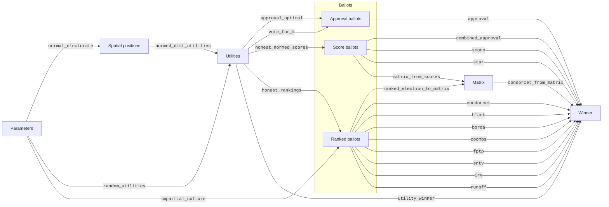

# Election Simulator 3000

[](https://circleci.com/gh/endolith/elsim)
[](https://github.com/endolith/elsim/actions)
[](https://codecov.io/gh/endolith/elsim)

This is a library of functions for simulating thousands of elections held using different [voting methods](https://en.wikipedia.org/wiki/Electoral_system) ([Borda count](https://en.wikipedia.org/wiki/Borda_count), [Approval voting](https://en.wikipedia.org/wiki/Approval_voting), etc.) under different voter models ([impartial culture](https://en.wikipedia.org/wiki/Impartial_culture), [spatial model](https://en.wikipedia.org/wiki/Spatial_model_of_voting), etc.) and estimating various metrics from them ([Social Utility Efficiency](https://en.wikipedia.org/wiki/Social_utility_efficiency) = Voter Satisfaction Efficiency = VSE, [Condorcet Efficiency](https://en.wikipedia.org/wiki/Condorcet_efficiency), [likelihood of Condorcet cycles](https://en.wikipedia.org/wiki/Condorcet_paradox#Likelihood_of_the_paradox), etc.)

For example, it can be used to reproduce Figure 1 from [Merrill 1984](https://www.jstor.org/stable/2110786):


Or the table of Effectiveness from [Weber 1977](https://elischolar.library.yale.edu/cowles-discussion-paper-series/732/):

|      | Standard | Vote-for-half | Borda |
| ---: | -------: | ------------: | ----: |
|    2 |    81.37 |         81.71 | 81.41 |
|    3 |    75.10 |         75.00 | 86.53 |
|    4 |    69.90 |         79.92 | 89.47 |
|    5 |    65.02 |         79.09 | 91.34 |
|    6 |    61.08 |         81.20 | 92.61 |
|   10 |    50.78 |         82.94 | 95.35 |
|  255 |    12.78 |         86.37 | 99.80 |

See [/examples](./examples) folder for more on what it can do, such as reproductions of previous research.

## Goals

- Fast (~25,000 elections per second on Core i7-9750H)
- Flexible
- Well-documented, easily-used and improved upon by other people
- Well-tested and bug-free
- Able to reproduce peer-reviewed research

## Requirements

See `requirements.txt`.  As of this README, it includes  [`numpy`](https://numpy.org/) and [`scipy`](https://www.scipy.org/) for the simulations, [`tabulate`](https://github.com/astanin/python-tabulate) for printing example tables, [`joblib`](https://joblib.readthedocs.io/en/latest/) for parallelizing extreme examples, and  [`pytest`](https://docs.pytest.org/en/latest/), [`hypothesis`](https://hypothesis.readthedocs.io/en/latest/), and [`pytest-cov`](https://github.com/pytest-dev/pytest-cov) for running the tests.  All should be installable through `conda`.

Optionally, `elsim` can use [`numba`](http://numba.pydata.org/) for speed.  If not available, the code will still run, just more slowly.

## Installation

One possibility is to install with pip:

```sh
pip install git+https://github.com/endolith/elsim.git
```

## Documentation

Currently just the docstrings of the submodules and functions themselves, in [`numpydoc` format](https://numpydoc.readthedocs.io/en/latest/format.html).  Now being rendered at https://endolith.github.io/elsim/

## Usage

Specify an election with three candidates (0, 1, 2), where two voters rank candidates 0 > 2 > 1, two voters rank candidates 1 > 2 > 0, and one ranks candidates 2 > 0 > 1:

```python
>>> election = [[0, 2, 1],
...             [0, 2, 1],
...             [1, 2, 0],
...             [1, 2, 0],
...             [2, 0, 1]]
```

Calculate the winner using Black's method:

```python
>>> from elsim.methods import black
>>> black(election)
2
```

Candidate 2 is the Condorcet winner, and wins under Black's method.

## Submodules and chained functions

Originally, the functions in submodules were meant to be chained together in a simple flow:

1. A function from `elsim.elections` takes parameters as input (number of candidates, number of voters, dispersion in spatial model, etc.) and produces an array of utilities (each voter's appraisal of each candidate).
2. Then a function from `elsim.strategies` converts each voter's utilities into a ballot.
3. Then a function from `elsim.methods` counts the collection of ballots and chooses a winner.


However, while implementing many different types of simulations, it has become more complicated.  Some functions produce intermediate results, while others skip over multiple steps.  I'm no longer sure the best way to organize these functions into submodules.  Here is a diagram showing the flow of every function currently in the submodules:



## Tests

Tests can be run by installing the testing dependencies and then running `pytest` in the project folder.

## Bugs / Requests

File issues on the [GitHub issue tracker](https://github.com/endolith/elsim/issues).

## Similar projects

### Election simulators

- 1D:
  - [Election Methods in Pictures ("Voteline")](http://zesty.ca/voting/voteline/) by Ka-Ping Yee - 5 candidates, normal/uniform/bimodal distribution
  - [Comparing Voting Systems for a Normal Distribution of Voters](https://demonstrations.wolfram.com/ComparingVotingSystemsForANormalDistributionOfVoters/) - Wolfram demonstration clone
- 2D:
  - [Voting Simulation Visualizations](http://zesty.ca/voting/sim/) by Ka-Ping Yee - "Yee diagrams"
  - [Elections On The Plane](http://bolson.org/voting/sim_one_seat/www/spacegraph.html) - Yee diagrams by Brian Olson
  - [Yee Pictures illustrating voting method behavior](http://rangevoting.org/IEVS/Pictures.html) by Warren D. Smith
- ND:
  - [Voter Satisfaction Efficiency](https://github.com/electology/vse-sim) by Jameson Quinn

### Voting system implementations

- [See the list on Electowiki](https://electowiki.org/wiki/Voting_links#Election_calculators)
