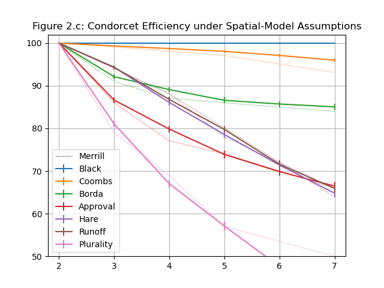

# Examples

These are some example scripts to demonstrate the various simulations that can be done, and to verify the simulator by reproducing results of already-published works.

## Wikipedia

### Likelihood of a Condorcet cycle

[Wikipedia's analytical example of likelihood of a Condorcet paradox](https://en.wikipedia.org/wiki/Condorcet_paradox#Impartial_culture_model) in an impartial culture model

|      |     3 |   101 |   201 |   301 |   401 |   501 |   601 |
| :--- | ----: | ----: | ----: | ----: | ----: | ----: | ----: |
| WP   | 5.556 | 8.690 | 8.732 | 8.746 | 8.753 | 8.757 | 8.760 |
| Sim  | 5.553 | 8.682 | 8.748 | 8.743 | 8.747 | 8.759 | 8.752 |
| Diff | 0.003 | 0.008 | 0.016 | 0.003 | 0.006 | 0.002 | 0.008 |

Source: [wikipedia_condorcet_paradox_likelihood.py](wikipedia_condorcet_paradox_likelihood.py)

## Niemi and Weisberg 1968, Klahr 1966

Reproduction of Condorcet paradox likelihood column and table

### Table 1: Probability That There Is No Majority Winner

|       |     2 |     3 |     4 |     5 |     6 |     7 |    10 |    23 |    49 |
|:------|------:|------:|------:|------:|------:|------:|------:|------:|------:|
| Niemi | 0.000 | 0.088 | 0.175 | 0.251 | 0.315 | 0.369 | 0.489 | 0.712 | 0.841 |
| Sim   | 0.002 | 0.095 | 0.179 | 0.253 | 0.321 | 0.372 | 0.488 | 0.728 | 0.843 |
| Diff  | 0.002 | 0.008 | 0.004 | 0.002 | 0.006 | 0.003 | 0.001 | 0.015 | 0.003 |

Source: [niemi_1968_table_1.py](niemi_1968_table_1.py)

### Table 2: Probabilities of No Majority Winner, P(m, n), for Equally Likely Rank Orders

|      |      3 |      5 |      7 |      9 |     11 |     13 |     15 |     17 |     19 |     21 |     23 |     25 |     27 |     29 |     59 |
| ---: | -----: | -----: | -----: | -----: | -----: | -----: | -----: | -----: | -----: | -----: | -----: | -----: | -----: | -----: | -----: |
|    3 | 0.0558 | 0.0698 | 0.0755 | 0.0779 | 0.0799 | 0.0812 | 0.0819 | 0.0826 | 0.0831 | 0.0830 | 0.0842 | 0.0839 | 0.0845 | 0.0840 | 0.0864 |
|    4 | 0.1110 | 0.1388 | 0.1506 | 0.1556 | 0.1599 | 0.1625 | 0.1641 | 0.1653 | 0.1662 | 0.1678 | 0.1675 | 0.1687 | 0.1697 | 0.1697 | 0.1728 |
|    5 | 0.1599 | 0.1996 | 0.2146 | 0.2230 | 0.2288 | 0.2331 | 0.2347 | 0.2367 | 0.2387 | 0.2395 | 0.2406 | 0.2416 | 0.2421 | 0.2437 | 0.2480 |
|    6 | 0.2023 | 0.2518 | 0.2707 | 0.2814 | 0.2884 | 0.2925 | 0.2948 | 0.2974 | 0.2993 | 0.3012 | 0.3030 | 0.3038 | 0.3036 | 0.3052 | 0.3110 |

(This also covers the same values as Figure 6. of Klahr, D. (1966). A Computer Simulation of the Paradox of Voting. *American Political Science Review*, *60*(2), 384–390.)

Source: [niemi_1968_table_2.py](niemi_1968_table_2.py)

## Weber 1977

Reproduction of utility and effectiveness tables and formulas from Weber (1977) *[Comparison of Public Choice Systems](https://cowles.yale.edu/publications/cfdp/cfdp-498)* 

### Table 4: The expected social utility of the elected candidate

Reproduce Table 4 from p. 17 of *Comparison of Voting Systems*: The expected social utility of the elected candidate, under three voting systems.

|    |   Standard |   Borda |   Approval |
|---:|-----------:|--------:|-----------:|
|  2 |     1.2505 |  1.2922 |     1.2920 |
|  3 |     1.8330 |  1.8748 |     1.8644 |
|  4 |     2.3889 |  2.4236 |     2.4210 |
|  5 |     2.9171 |  2.9768 |     2.9727 |
| 10 |     5.5970 |  5.6701 |     5.6714 |
| 15 |     8.2248 |  8.3207 |     8.3246 |
| 20 |    10.8325 | 10.9470 |    10.9537 |
| 25 |    13.4320 | 13.5583 |    13.5659 |
| 30 |    16.0177 | 16.1577 |    16.1669 |

Source: [weber_1977_table_4.py](weber_1977_table_4.py)

### The Effectiveness of Several Voting Systems

Reproduce table from p. 19 of *Reproducing Voting Systems* using Monte Carlo methods (incomplete)

|      | Standard | Vote-for-half | Borda |
| ---: | -------: | ------------: | ----: |
|    2 |    81.37 |         81.71 | 81.41 |
|    3 |    75.10 |         75.00 | 86.53 |
|    4 |    69.90 |         79.92 | 89.47 |
|    5 |    65.02 |         79.09 | 91.34 |
|    6 |    61.08 |         81.20 | 92.61 |
|   10 |    50.78 |         82.94 | 95.35 |
|  255 |    12.78 |         86.37 | 99.80 |

Source: [weber_1977_effectiveness_table.py](weber_1977_effectiveness_table.py)

### Closed-form effectiveness expressions

Reproduce table from p. 19 of *Reproducing Voting Systems* using Weber's closed-form expressions to verify them.

| *m*  | Standard | Vote-for-half | Best Vote-for-or-against-k |   Borda |
| :--- | -------: | ------------: | -------------------------: | ------: |
| 2    |   81.65% |        81.65% |                     81.65% |  81.65% |
| 3    |   75.00% |        75.00% |                     87.50% |  86.60% |
| 4    |   69.28% |        80.00% |                     80.83% |  89.44% |
| 5    |   64.55% |        79.06% |                     86.96% |  91.29% |
| 6    |   60.61% |        81.32% |                     86.25% |  92.58% |
| 10   |   49.79% |        82.99% |                     88.09% |  95.35% |
| ∞    |    0.00% |        86.60% |                     92.25% | 100.00% |

Source: [weber_1977_expressions.py](weber_1977_expressions.py)

### Vote-for-k effectiveness

Compare Monte Carlo method with closed-form expressions for Vote-for-k method

|      |    1 |    2 |    3 |    4 | half |
| ---: | ---: | ---: | ---: | ---: | ---: |
|    2 | 81.6 |      |      |      | 81.6 |
|    3 | 75.0 | 75.2 |      |      | 75.0 |
|    4 | 69.4 | 80.1 | 69.2 |      | 80.1 |
|    5 | 64.4 | 79.1 | 79.1 | 64.9 | 79.1 |
|    6 | 60.8 | 76.6 | 81.4 | 76.6 | 81.4 |
|    7 | 57.1 | 74.0 | 81.1 | 81.1 | 81.1 |
|    8 | 54.4 | 71.3 | 79.7 | 82.3 | 82.3 |
|    9 | 51.8 | 68.5 | 77.8 | 82.0 | 82.0 |
|   10 | 49.7 | 66.4 | 75.9 | 81.5 | 83.0 |

Source: [weber_1977_verify_vote_for_k.py](weber_1977_verify_vote_for_k.py)

## Merrill 1984

Merrill (1984) *[A Comparison of Efficiency of Multicandidate Electoral Systems](https://www.jstor.org/stable/2110786)* 

Reproduction of Condorcet efficiency (CE) and social utility efficiency (SUE) tables and figures:

### Table 1 / Fig. 1: CE random society

| Method    |     2 |     3 |     4 |     5 |     7 |    10 |
| :-------- | ----: | ----: | ----: | ----: | ----: | ----: |
| Plurality | 100.0 |  79.1 |  68.4 |  61.8 |  51.4 |  41.1 |
| Runoff    | 100.0 |  96.2 |  89.6 |  83.4 |  72.3 |  60.3 |
| Hare      | 100.0 |  96.2 |  92.5 |  89.1 |  83.7 |  77.0 |
| Approval  | 100.0 |  75.6 |  70.0 |  67.4 |  63.8 |  61.2 |
| Borda     | 100.0 |  90.9 |  87.4 |  85.9 |  84.6 |  83.9 |
| Coombs    | 100.0 |  96.9 |  93.4 |  91.0 |  86.4 |  81.7 |
| Black     | 100.0 | 100.0 | 100.0 | 100.0 | 100.0 | 100.0 |
| SU max    | 100.0 |  84.1 |  79.6 |  78.4 |  77.3 |  77.5 |
| CW        | 100.0 |  91.7 |  83.1 |  75.6 |  64.3 |  52.9 |

Source: [merrill_1984_table_1_fig_1.py](merrill_1984_table_1_fig_1.py)

### Table 2: CE spatial model

(Markdown can't handle colspan or multiple header rows)

| Disp      |   1.0 |   1.0 |   1.0 |   1.0 |   0.5 |   0.5 |   0.5 |   0.5 |
| :-------- | ----: | ----: | ----: | ----: | ----: | ----: | ----: | ----: |
| Corr      |   0.5 |   0.5 |   0.0 |   0.0 |   0.5 |   0.5 |   0.0 |   0.0 |
| Dims      |     2 |     4 |     2 |     4 |     2 |     4 |     2 |     4 |
| Plurality |  57.5 |  65.8 |  62.2 |  78.4 |  21.7 |  24.4 |  27.2 |  41.3 |
| Runoff    |  80.1 |  87.3 |  81.6 |  93.6 |  35.4 |  42.2 |  41.5 |  61.5 |
| Hare      |  79.2 |  86.7 |  84.0 |  95.4 |  35.9 |  46.8 |  41.0 |  69.9 |
| Approval  |  73.8 |  77.8 |  76.9 |  85.4 |  71.5 |  76.4 |  73.8 |  82.7 |
| Borda     |  87.1 |  89.3 |  88.2 |  92.3 |  83.7 |  86.3 |  85.2 |  89.4 |
| Coombs    |  97.8 |  97.3 |  97.9 |  98.2 |  93.5 |  92.3 |  93.8 |  94.5 |
| Black     | 100.0 | 100.0 | 100.0 | 100.0 | 100.0 | 100.0 | 100.0 | 100.0 |
| SU max    |  82.9 |  85.8 |  85.3 |  90.8 |  78.1 |  81.5 |  80.8 |  87.1 |
| CW        |  99.7 |  99.7 |  99.7 |  99.6 |  98.9 |  98.6 |  98.7 |  98.5 |

Source: [merrill_1984_table_2.py](merrill_1984_table_2.py)

### Fig 2a 2b: Spatial model scatter plots

Source: [merrill_1984_fig_2a_2b.py](merrill_1984_fig_2a_2b.py)

### Fig 2c 2d: CE spatial model

#### 2.c

| Method    |     2 |     3 |     4 |     5 |     6 |     7 |
| :-------- | ----: | ----: | ----: | ----: | ----: | ----: |
| Black     | 100.0 | 100.0 | 100.0 | 100.0 | 100.0 | 100.0 |
| Coombs    | 100.0 |  99.4 |  98.6 |  97.8 |  96.9 |  96.0 |
| Borda     | 100.0 |  91.4 |  89.2 |  87.1 |  85.7 |  84.6 |
| Approval  | 100.0 |  85.9 |  79.8 |  73.9 |  70.1 |  66.8 |
| Hare      | 100.0 |  94.1 |  86.6 |  78.9 |  71.7 |  65.2 |
| Runoff    | 100.0 |  94.1 |  87.1 |  79.7 |  72.8 |  66.1 |
| Plurality | 100.0 |  80.6 |  67.6 |  57.4 |  49.3 |  42.6 |

#### 2.d

| Method    |     2 |     3 |     4 |     5 |     6 |     7 |
| :-------- | ----: | ----: | ----: | ----: | ----: | ----: |
| Black     | 100.0 | 100.0 | 100.0 | 100.0 | 100.0 | 100.0 |
| Coombs    | 100.0 |  98.2 |  95.9 |  93.4 |  90.9 |  88.4 |
| Borda     | 100.0 |  89.2 |  86.3 |  83.8 |  82.1 |  80.8 |
| Approval  | 100.0 |  84.0 |  76.9 |  71.5 |  67.8 |  64.7 |
| Hare      | 100.0 |  72.2 |  50.3 |  35.8 |  26.0 |  19.7 |
| Runoff    | 100.0 |  72.2 |  50.6 |  35.3 |  24.4 |  16.9 |
| Plurality | 100.0 |  55.9 |  34.7 |  21.5 |  13.5 |   8.5 |

Source: [merrill_1984_fig_2c_2d.py](merrill_1984_fig_2c_2d.py)

### Table 3 / Fig  3: SUE random society

| Method    |     2 |    3 |    4 |    5 |    7 |   10 |
| :-------- | ----: | ---: | ---: | ---: | ---: | ---: |
| Plurality | 100.0 | 83.3 | 75.1 | 69.5 | 62.5 | 54.9 |
| Runoff    | 100.0 | 89.1 | 83.9 | 80.4 | 75.1 | 69.1 |
| Hare      | 100.0 | 89.0 | 84.8 | 82.5 | 79.9 | 77.3 |
| Approval  | 100.0 | 95.5 | 91.3 | 89.3 | 87.8 | 86.8 |
| Borda     | 100.0 | 94.7 | 94.3 | 94.4 | 95.3 | 96.2 |
| Coombs    | 100.0 | 90.2 | 86.8 | 85.2 | 84.0 | 82.9 |
| Black     | 100.0 | 92.9 | 92.0 | 92.1 | 93.2 | 94.6 |

Source: [merrill_1984_table_3_fig_3.py](merrill_1984_table_3_fig_3.py)

### Table 4: SUE spatial model

(Markdown can't handle colspan or multiple header rows)

| Disp      |   1.0 |   1.0 |   1.0 |   1.0 |   0.5 |   0.5 |   0.5 |   0.5 |
| :-------- | ---: | ---: | ---: | ---: | ---: | ---: | ---: | ---: |
| Corr      |   0.5 |   0.5 |   0.0 |   0.0 |   0.5 |   0.5 |   0.0 |   0.0 |
| Dims      |    2 |    4 |    2 |    4 |    2 |    4 |    2 |    4 |
| Plurality | 72.1 | 79.1 | 80.4 | 92.4 |  4.0 |  6.3 | 25.2 | 52.9 |
| Runoff    | 90.5 | 94.2 | 92.0 | 97.5 | 36.6 | 43.6 | 53.3 | 75.3 |
| Hare      | 91.7 | 94.7 | 94.3 | 98.4 | 46.4 | 57.7 | 58.7 | 83.6 |
| Approval  | 96.2 | 97.0 | 96.8 | 98.5 | 95.6 | 96.8 | 95.8 | 98.0 |
| Borda     | 97.8 | 98.6 | 98.3 | 99.4 | 96.6 | 97.7 | 97.4 | 99.0 |
| Coombs    | 97.0 | 97.5 | 97.7 | 98.7 | 94.0 | 94.3 | 95.0 | 96.7 |
| Black     | 97.3 | 97.8 | 98.0 | 99.0 | 95.5 | 96.1 | 96.5 | 98.0 |

Source: [merrill_1984_table_4.py](merrill_1984_table_4.py)

### Fig 4a 4b: SUE spatial model

#### 4.a

| Method    |     2 |    3 |    4 |    5 |    7 |
| :-------- | ----: | ---: | ---: | ---: | ---: |
| Black     | 100.0 | 97.1 | 97.1 | 97.3 | 97.8 |
| Coombs    | 100.0 | 97.0 | 96.8 | 97.0 | 97.4 |
| Borda     | 100.0 | 98.7 | 98.2 | 97.9 | 97.7 |
| Approval  | 100.0 | 98.7 | 97.4 | 96.2 | 95.3 |
| Hare      | 100.0 | 94.1 | 92.7 | 91.7 | 90.2 |
| Runoff    | 100.0 | 94.1 | 92.0 | 90.5 | 87.4 |
| Plurality | 100.0 | 84.4 | 77.3 | 72.0 | 64.8 |

#### 4.b

| Method    |     2 |    3 |    4 |    5 |     7 |
| :-------- | ----: | ---: | ---: | ---: | ----: |
| Black     | 100.0 | 95.4 | 95.2 | 95.5 |  96.1 |
| Coombs    | 100.0 | 94.9 | 94.1 | 94.0 |  94.1 |
| Borda     | 100.0 | 97.9 | 97.1 | 96.6 |  96.2 |
| Approval  | 100.0 | 98.5 | 96.8 | 95.5 |  94.5 |
| Hare      | 100.0 | 70.2 | 55.8 | 46.7 |  34.7 |
| Runoff    | 100.0 | 70.1 | 51.4 | 36.8 |  13.6 |
| Plurality | 100.0 | 50.0 | 23.2 |  4.0 | -24.7 |

Source: [merrill_1984_fig_4a_4b.py](merrill_1984_fig_4a_4b.py)
